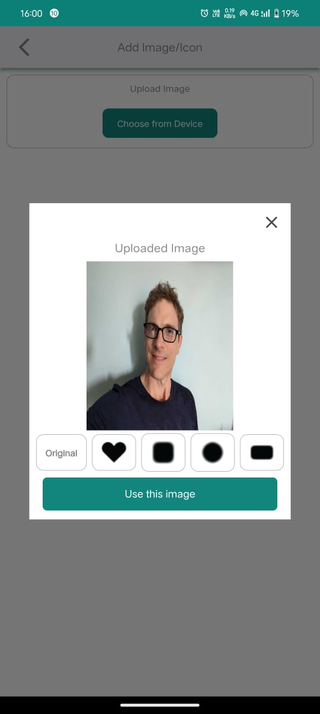

# Celebrare
A new Flutter project made for an internship assignment at [Celebrare](https://celebrare.in/).

## Project Logo
<div align="center">
  
</div>

## App Download
Download the [APK file](app-release.apk) for Android.


## Screenshots
<div align="center">
  
  
  
  
  
</div>


## Installation

To install this project, follow these steps:
1. Clone the repository.
   ```sh
   git clone https://github.com/a19hu/Celebrare.git

2. Navigate to the project directory.
   ```sh
   cd Celebrare

3. Install the dependencies.
   ```sh
    flutter pub get

4. Run app.
   ```sh
   flutter run
